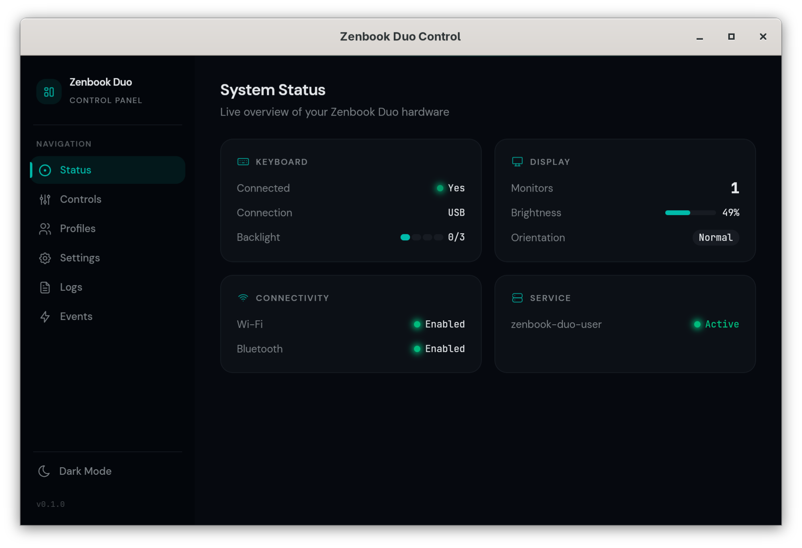
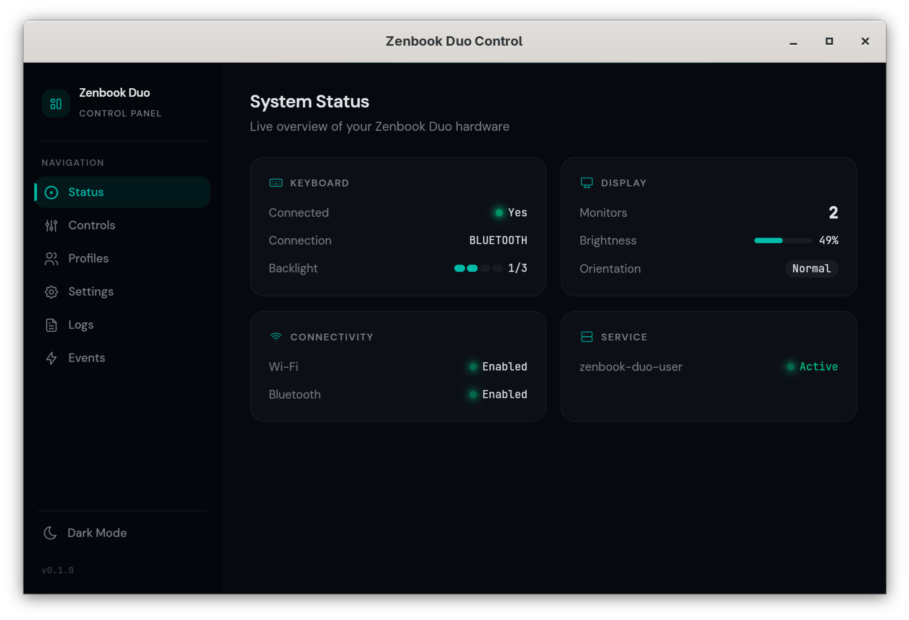

# Linux for the ASUS Zenbook Duo

This project adds better Linux support for the Zenbook Duo by running a small background service that reacts to the keyboard being attached/detached (USB or Bluetooth) and keeps the dual-screen experience usable.

## Quick Start (Non-technical)

### What you need

- An ASUS Zenbook Duo
- GNOME on Wayland (tested on Fedora; Ubuntu GNOME should also work)
- A Terminal and your sudo password (the installer needs to change system settings)

### Install (recommended)

1. Download this repo (GitHub "Code" → "Download ZIP"), then extract it.
2. Open a Terminal in the extracted folder.
3. Run the installer and answer the prompts:

```bash
./setup.sh
```

4. Log out and back in (needed for permission changes).

### Optional: install the Control Panel app (UI)

If you want a desktop app to toggle settings easily (run `./setup.sh` first):

```bash
./install-ui.sh
```

You can also do a one-line install (downloads the repo to a temp folder, builds, and installs):

```bash
curl -fsSLo /tmp/install-ui.sh https://raw.githubusercontent.com/zakstam/zenbook-duo-linux/main/install-ui.sh && bash /tmp/install-ui.sh
```

### Uninstall

To remove the background service and system changes:

```bash
./uninstall.sh
```

To remove the optional UI app:

- Fedora / RHEL-based: `sudo dnf remove zenbook-duo-control`
- Debian / Ubuntu-based: `sudo apt remove zenbook-duo-control`

---

## Advanced (Technical)

### Screenshots




### Features

| Feature | USB | Bluetooth |
|---------|:---:|:---------:|
| Toggle bottom screen on when keyboard removed | ✅ | ✅ |
| Toggle bottom screen off when keyboard placed | ✅ | ✅ |
| Toggle bluetooth on when keyboard removed | ✅ | ✅ |
| Toggle bluetooth off when keyboard placed (if it was off before) | ✅ | ✅ |
| Screen brightness sync | ✅ | ✅ |
| Reset airplane mode on keyboard attach/detach | ✅ | N/A |
| Keyboard backlight set on boot/attach | ✅ | ✅ |
| Keyboard backlight sync across attach/detach | ✅ | ✅ |
| Keyboard backlight cycle (F4) | ✅ | ✅ |
| Correct state on boot/resume (suspend & hibernate) | ✅ | ✅ |
| Auto rotation | ✅ | ✅ |
| Function keys (F1 mute, F2 volume down, F3 volume up, F10 bluetooth) | ✅ | ✅ |
| Function keys (F5 brightness down, F6 brightness up) | ✅ | ✅ |
| Function keys (F7 swap displays) | ✅ | ✅ |
| Function keys (F9 mic mute) | ✅ | ❌ |
| Function keys (F11 emojis) | ✅ | ✅ (Fn+F11) |
| Function keys (F8 airplane mode, F12 ASUS software) | ❌ | ❌ |
| Correct state on lock/unlock | ✅ | ✅ |
| Fn layer (top row) | ✅ | ✅ |

Notes:
- USB top row defaults to media keys; hold `Fn` for `F1`-`F12`.
- Do not install hwdb remaps for `KEYBOARD_KEY_7003*` on USB (it overrides the Fn layer).

### Requirements

- ASUS Zenbook Duo (USB vendor `0B05`, product `1B2C`)
- Linux with GNOME on Wayland (tested with Fedora)
- `systemd` for service management
- `gdctl` (part of `mutter`) for display configuration

### What `./setup.sh` changes

- Installs dependencies (`inotify-tools`, `usbutils`, `mutter`/`gdctl`, `iio-sensor-proxy`, `python3-usb`/`python3-pyusb`, `evtest`)
- Installs `duo.sh` to `/usr/local/bin/duo` (or uses repo path in `--dev-mode`)
- Adds sudoers rules for a small set of brightness/backlight helper commands
- Adds your user to the `input` group (logout/login required)
- Installs a udev rule for the Zenbook Duo keyboard
- Installs/enables systemd units:
  - `zenbook-duo.service` (system boot/shutdown)
  - `zenbook-duo-user.service` (user session)

### Upgrading from older versions

If you previously installed a hwdb key remap, remove it so `Fn`+`F1`-`F12` works on USB:

```bash
sudo rm -f /etc/udev/hwdb.d/90-zenbook-duo-keyboard.hwdb
sudo systemd-hwdb update
sudo udevadm trigger
```

### Supported distros

| Distro | Package Manager |
|--------|----------------|
| Fedora / RHEL-based | `dnf` |
| Debian / Ubuntu-based | `apt` |

Other distros: install dependencies manually and run `./setup.sh` (it exits if it cannot detect your package manager).

### Control Panel UI (Tauri + React)

- Build & install: `./install-ui.sh`
- Dev mode:

```bash
cd ui-tauri-react
npm install
npm run dev
```

Hotkey note (GNOME Wayland): create a GNOME custom shortcut that runs:

```bash
zenbook-duo-control --toggle-usb-media-remap
```

### Development

To iterate on `duo.sh` without reinstalling:

```bash
./setup.sh --dev-mode
```
