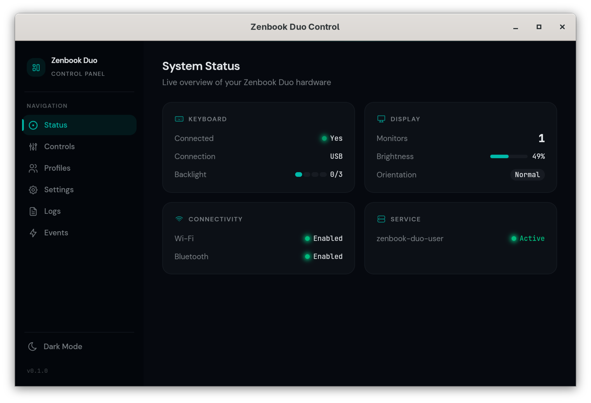
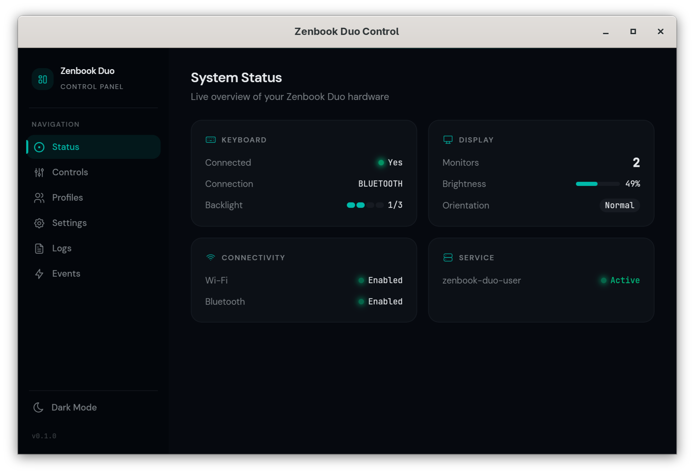

# Linux for the ASUS Zenbook Duo

This project adds better Linux support for the Zenbook Duo by running a small background service that reacts to the keyboard being attached/detached (USB or Bluetooth) and keeps the dual-screen experience usable.

## Quick Start (Non-technical)

### What you need

- An ASUS Zenbook Duo
- GNOME on Wayland, KDE Plasma on Wayland, or Niri (tested on Fedora; Ubuntu GNOME should also work)
- A Terminal and your sudo password (the installer needs to change system settings)

### Install (recommended)

One-line install:

```bash
curl -fsSL https://raw.githubusercontent.com/zakstam/zenbook-duo-linux/main/install.sh | bash
```

1. Download this repo (GitHub "Code" → "Download ZIP"), then extract it.
2. Open a Terminal in the extracted folder.
3. Run the installer and answer the prompts:

```bash
./install.sh
```

Notes:
- `install.sh` auto-detects GNOME, KDE Plasma, or Niri and then runs the matching setup script plus the UI installer.
- If you prefer to run it with sudo, use `sudo -E ./install.sh` (so per-user setup targets your user session).
- If you re-run the installer, restart the session agent: `systemctl --user restart zenbook-duo-session-agent.service`

4. Log out and back in (needed for permission changes).

Manual fallback:

```bash
./setup-gnome.sh
# or
./setup-kde.sh
# or
./setup-niri.sh
```

### Optional: install or update just the Control Panel app (UI)

If you only want to build/update the desktop app:

```bash
./install-ui.sh
```

### Uninstall

To remove the background service and system changes:

```bash
./uninstall.sh
```

To remove the optional UI app:

- Fedora / RHEL-based: `sudo dnf remove zenbook-duo-control`
- Debian / Ubuntu-based: `sudo apt remove zenbook-duo-control`

---

## Advanced (Technical)

### Screenshots




### Features

| Feature | USB | Bluetooth |
|---------|:---:|:---------:|
| Toggle bottom screen on when keyboard removed | ✅ | ✅ |
| Toggle bottom screen off when keyboard placed | ✅ | ✅ |
| Toggle bluetooth on when keyboard removed | ✅ | ✅ |
| Toggle bluetooth off when keyboard placed (if it was off before) | ✅ | ✅ |
| Screen brightness sync | ✅ | ✅ |
| Reset airplane mode on keyboard attach/detach | ✅ | N/A |
| Keyboard backlight set on boot/attach | ✅ | ✅ |
| Keyboard backlight sync across attach/detach | ✅ | ✅ |
| Keyboard backlight cycle (F4) | ✅ | ✅ |
| Correct state on boot/resume (suspend & hibernate) | ✅ | ✅ |
| Auto rotation | ✅ | ✅ |
| Function keys (F1 mute, F2 volume down, F3 volume up, F10 bluetooth) | ✅ | ✅ |
| Function keys (F5 brightness down, F6 brightness up) | ✅ | ✅ |
| Function keys (F7 swap displays) | ✅ | ✅ |
| Function keys (F9 mic mute) | ✅ | ❌ |
| Function keys (F11 emojis) | ✅ | ✅ (Fn+F11) |
| Function keys (F8 airplane mode, F12 ASUS software) | ❌ | ❌ |
| Correct state on lock/unlock | ✅ | ✅ |
| Fn layer (top row) | ✅ | ✅ |

Notes:
- USB top row defaults to media keys; hold `Fn` for `F1`-`F12`.
- Do not install hwdb remaps for `KEYBOARD_KEY_7003*` on USB (it overrides the Fn layer).

### Requirements

- ASUS Zenbook Duo (USB vendor `0B05`, product `1B2C`)
- Linux with GNOME on Wayland or KDE Plasma on Wayland (tested with Fedora)
- `systemd` for service management
- GNOME: `gdctl` (part of `mutter`) for display configuration
- KDE: `kscreen-doctor` (part of `kscreen`) for display configuration

### What `./setup-gnome.sh` / `./setup-kde.sh` / `./setup-niri.sh` change

- Installs dependencies:
  - Common: `usbutils`, `iio-sensor-proxy`, `systemd`
  - GNOME: `mutter`/`gdctl` (via `setup-gnome.sh`)
  - KDE: `kscreen`/`kscreen-doctor` (via `setup-kde.sh`)
  - Niri: `niri` (via `setup-niri.sh`)
- Adds your user to the `input` group (logout/login required)
- Installs a udev rule for the Zenbook Duo keyboard
- Installs/enables Rust runtime units:
  - `zenbook-duo-rust-daemon.service` (system daemon)
  - `zenbook-duo-rust-lifecycle.service` (boot/shutdown + sleep hook)
  - `zenbook-duo-session-agent.service` (user session)
- Installs Rust runtime binaries to `/usr/local/libexec/zenbook-duo`
- Adds sudoers rules for brightness writes used by the session agent

### Troubleshooting

- Nothing happens when docking/undocking:
  - Check the services are running: `systemctl status zenbook-duo-rust-daemon.service` and `systemctl --user status zenbook-duo-session-agent.service`
  - Watch daemon logs: `journalctl -u zenbook-duo-rust-daemon.service -f`
- `Failed to read events: No such device (os error 19)` when reattaching the keyboard:
  - This comes from the optional USB media remap helper when the event node disappears during hotplug.
  - Make sure you are on the latest version, then restart the session agent once: `systemctl --user restart zenbook-duo-session-agent.service`
  - You do not need a separate `/etc/udev/rules.d/*uinput*` rule for this project.
- `KBLIGHT - Device lost, re-scanning` in a loop:
  - You likely need to log out and back in so your session gets the `input` group membership

### Upgrading from older versions

If you previously installed a hwdb key remap, remove it so `Fn`+`F1`-`F12` works on USB:

```bash
sudo rm -f /etc/udev/hwdb.d/90-zenbook-duo-keyboard.hwdb
sudo systemd-hwdb update
sudo udevadm trigger
```

### Supported distros

| Distro | Package Manager |
|--------|----------------|
| Fedora / RHEL-based | `dnf` |
| Debian / Ubuntu-based | `apt` |

Other distros: install dependencies manually and run `./setup-gnome.sh`, `./setup-kde.sh`, or `./setup-niri.sh` (it exits if it cannot detect your package manager).

### Control Panel UI (Tauri + React)

- Build & install: `./install-ui.sh`
- Dev mode:

```bash
cd ui-tauri-react
npm install
npm run dev
```

## Fedora: “Nobara-like” setup helper

If you’re on Fedora and want a more “Nobara-like” out-of-box experience (RPM Fusion, codecs, common gaming tools), there’s an optional helper script:

```bash
./nobara-like.sh
```

It can also add the Nobara COPR repo definitions **disabled by default**, so you can cherry-pick packages without mixing repos during normal upgrades.
