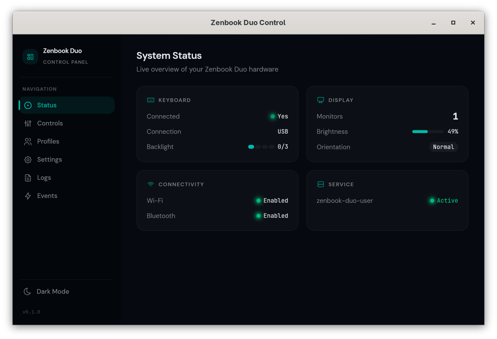
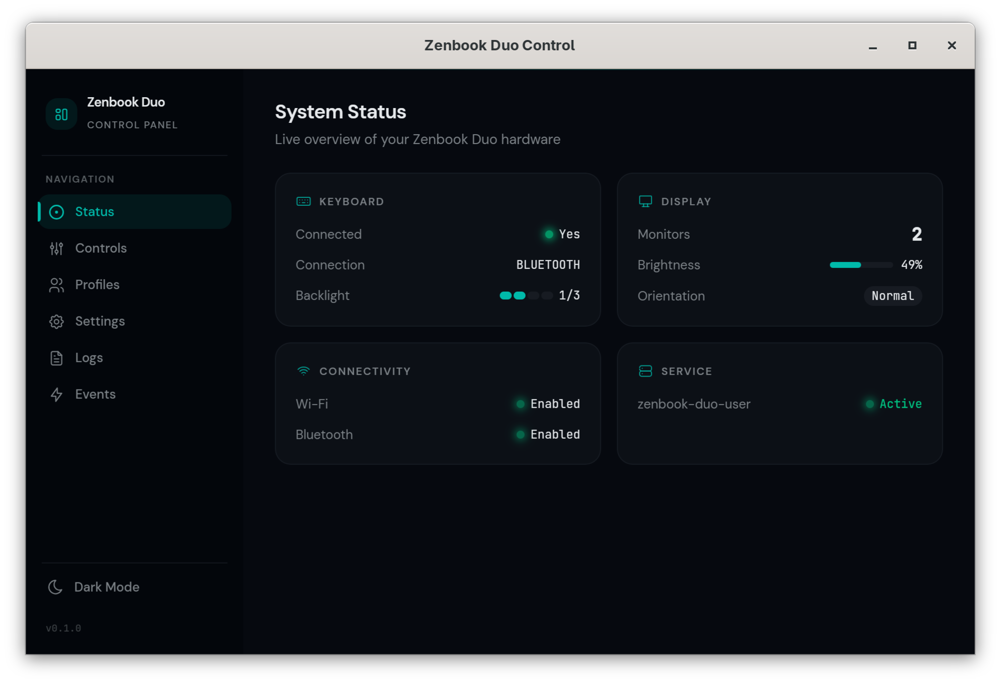

# Linux for the ASUS Zenbook Duo

Linux support tooling for the ASUS Zenbook Duo. The project installs a Rust hardware runtime plus an optional Tauri/React Control Panel so the detachable keyboard, dual displays, rotation, brightness, backlight, hotkeys, touchscreen controls, and related laptop behavior keep working across USB/Bluetooth attach and detach, boot, resume, lock, and desktop-session transitions.

This is intentionally device-specific. The goal is a dependable Zenbook Duo experience on the supported Linux desktop matrix, not a generic dual-screen laptop framework.

## What it does

- Detects the Zenbook Duo keyboard over USB and Bluetooth.
- Switches between docked and tablet-style display layouts when the keyboard is attached or removed.
- Keeps keyboard backlight, display brightness, Bluetooth/Wi-Fi restore behavior, rotation, and saved settings coordinated through a Rust daemon.
- Provides USB media remapping for Zenbook Duo top-row keys, including mute/volume, brightness, keyboard backlight cycling, and emoji launcher behavior where supported.
- Handles Bluetooth backlight and brightness hotkeys through the daemon.
- Supports per-display touchscreen enable/disable for the built-in ELAN panels, persisted across reboot/resume.
- Provides a Control Panel for status, display layout, controls, profiles, settings, logs, events, and diagnostics.

Known boundaries:

- Supported hardware target: ASUS Zenbook Duo.
- Supported desktop backends: GNOME Wayland, KDE Plasma Wayland, Hyprland, and Niri.
- X11 and other compositors are not first-class targets.
- Some vendor-specific keys, such as airplane mode and ASUS software keys, are not implemented by this project.

## Quick start

### Requirements

- ASUS Zenbook Duo.
- GNOME on Wayland, KDE Plasma on Wayland, Hyprland, or Niri.
- `systemd` with working system and user service managers.
- A supported package-manager family for automatic setup: `dnf`, `apt`, or `pacman`.
- Rust toolchain with `cargo` available; the runtime is built locally during install.
- A terminal, internet access, and your sudo/admin password.

### One-line install or update

```bash
curl -fsSL https://raw.githubusercontent.com/zakstam/zenbook-duo-linux/main/install.sh | bash
```

`install.sh` detects GNOME, KDE Plasma, Hyprland, or Niri, runs the matching setup wrapper, installs the Rust runtime services, and then builds/installs the Control Panel unless you opt out.

Useful one-line variants:

```bash
curl -fsSL https://raw.githubusercontent.com/zakstam/zenbook-duo-linux/main/install.sh | bash -s -- --skip-ui
curl -fsSL https://raw.githubusercontent.com/zakstam/zenbook-duo-linux/main/install.sh | bash -s -- --no-usb-media-remap
```

The same options work from a local checkout:

```bash
./install.sh --skip-ui              # install/update only the runtime services
./install.sh --no-usb-media-remap   # leave USB media remap disabled by default
sudo -E ./install.sh                # allowed, but a real sudo user session is required
```

After a fresh install, log out and back in so group membership and session environment changes take effect. If you are only updating and something looks stale, restart the user session agent:

```bash
systemctl --user restart zenbook-duo-session-agent.service
```

### Local checkout install

```bash
git clone https://github.com/zakstam/zenbook-duo-linux.git
cd zenbook-duo-linux
./install.sh
```

If desktop auto-detection fails, run the matching setup wrapper directly:

```bash
./setup-gnome.sh
# or
./setup-kde.sh
# or
./setup-hyprland.sh
# or
./setup-niri.sh
```

The setup wrappers install the runtime services. To build or update only the Control Panel app, run:

```bash
./install-ui.sh
```

On desktop sessions, the UI installer prefers a graphical admin-password prompt for system install steps and falls back to terminal `sudo` when needed.

## Control Panel

Screenshots:




The Control Panel can be launched from your app menu as **Zenbook Duo Control**, or from a terminal:

```bash
zenbook-duo-control
```

Main pages:

- **Status** — live keyboard, display, connectivity, service, version, and USB-remap status.
- **Displays** — connected display layout, scale, refresh mode where available, and mapped touchscreen toggles.
- **Controls** — keyboard backlight, orientation, service restart, and touchscreen toggles.
- **Profiles** — save and activate common hardware configurations.
- **Settings** — defaults such as backlight, scale, theme, start-on-boot, rotation inversion, and USB media remap.
- **Logs / Events** — runtime log output and recent hardware/service events.
- **Diagnostics** — evdev, HID, report descriptor, and hidraw capture helpers for debugging hardware behavior.

## Installed components

The installer/setup scripts make system-level changes because the project controls hardware and desktop-session behavior:

- Installs common dependencies: `usbutils`, `iio-sensor-proxy`, and `systemd`.
- Installs backend dependencies:
  - GNOME: `mutter` / `gdctl`
  - KDE Plasma: `kscreen` / `kscreen-doctor`
  - Hyprland: `hyprland` (provides `hyprctl`)
  - Niri: `niri`
- Adds the target user to the `input` group. Log out/in after first install.
- Installs a udev rule for the Zenbook Duo keyboard.
- Removes the old Zenbook Duo hwdb remap if present because it breaks the USB Fn layer.
- Adds the sudoers entry needed for brightness writes used by the session agent.
- Installs Rust runtime binaries under `/usr/local/libexec/zenbook-duo`.
- Installs/enables these services:
  - `zenbook-duo-rust-daemon.service` — system daemon and hardware authority.
  - `zenbook-duo-rust-lifecycle.service` — boot/shutdown and sleep lifecycle hook.
  - `zenbook-duo-session-agent.service` — per-user session agent for compositor/session actions.
- Stores user settings under `~/.config/zenbook-duo`.

## Architecture snapshot

- **Rust system daemon**: owns hardware state, policy, persistence, privileged operations, logs/events, Bluetooth hotkeys, and daemon IPC.
- **Rust session agent**: runs in the user session and executes compositor-bound work such as GNOME/KDE/Hyprland/Niri display changes, brightness sync watchers, rotation handling, and desktop notifications.
- **Tauri/React Control Panel**: client UI for status, controls, settings, profiles, logs, events, and diagnostics. It should use daemon/session APIs instead of owning hardware policy itself.
- **Bash installers**: keep install/update simple while centralizing shared setup behavior in `setup-common.sh` and keeping desktop wrappers thin.

## Supported matrix

Desktop backends:

| Desktop backend | Setup wrapper | Display command |
|-----------------|---------------|-----------------|
| GNOME on Wayland | `setup-gnome.sh` | `gdctl` |
| KDE Plasma on Wayland | `setup-kde.sh` | `kscreen-doctor` |
| Hyprland | `setup-hyprland.sh` | `hyprctl` |
| Niri | `setup-niri.sh` | `niri msg` |

The Hyprland backend owns only the two internal Duo panels discovered through DRM eDP metadata. External outputs are inspected but never reconfigured. Systems with nonstandard internal connector names can set `ZENBOOK_DUO_UPPER_CONNECTOR` and `ZENBOOK_DUO_LOWER_CONNECTOR` in the session-agent service environment.

Package-manager families used by the automated setup paths:

| Distro family | Package manager |
|---------------|-----------------|
| Fedora / RHEL-based | `dnf` |
| Debian / Ubuntu-based | `apt` |
| Arch / CachyOS | `pacman` |

Other distributions may be possible with manual dependency installation and script adaptation, but they are not automated by the current setup flow.

## Troubleshooting

### Nothing happens when docking or undocking

Check both services:

```bash
systemctl status zenbook-duo-rust-daemon.service
systemctl --user status zenbook-duo-session-agent.service
```

Watch daemon logs:

```bash
journalctl -u zenbook-duo-rust-daemon.service -f
```

Also check the Control Panel **Logs**, **Events**, and **Diagnostics** pages.

### Reboot, login, unlock, or resume comes up in the wrong layout

The lifecycle service and session agent should re-sync the current attached/detached state after boot, login, resume, and unlock. If they do not:

```bash
systemctl --user status zenbook-duo-session-agent.service
systemctl --user show-environment | grep -E 'DISPLAY|WAYLAND_DISPLAY|NIRI_SOCKET|HYPRLAND_INSTANCE_SIGNATURE|XDG_CURRENT_DESKTOP|XDG_SESSION_DESKTOP|DESKTOP_SESSION|XDG_SESSION_TYPE'
```

An early `No supported session backend became ready before timeout; continuing to wait` warning is OK if the session agent remains active. If desktop-session environment variables are missing after reinstalling, rerun `./install.sh` from an active desktop session, then log out and back in once.

### Keyboard media or Fn keys stop working after suspend or reattach

The optional USB media remap helper is stopped before sleep and retried after resume. If recovery still fails, check daemon logs for `USB media remap auto-start failed` or repeated `No such device` messages:

```bash
journalctl -u zenbook-duo-rust-daemon.service -f
```

You do not need a separate `/etc/udev/rules.d/*uinput*` rule for this project.

### USB top row and the Fn layer

When docked over USB, the optional USB media remap turns the top row into media keys (F1-F3 volume, F4 backlight, F5/F6 brightness, F11 emojis). Holding `Fn` sends plain `F1`-`F12` only if the keyboard reports the Fn key over USB. The remap logs which case applies when it starts: look for `Fn key reported by` or `No keyboard node reports the Fn key` in `/run/user/$UID/zenbook-duo/duo.log`.

If Fn is not reported, use pause as an Fn-lock: bind `zenbook-duo-control --toggle-remap-pause` to a desktop shortcut (or use the Pause button in the app). While paused the top row sends plain `F1`-`F12`, and you get a notification on each toggle.

Do not install hwdb remaps for `KEYBOARD_KEY_7003*` on USB; it overrides the Fn layer.

### Keyboard backlight scanning loops

If you see repeated `KBLIGHT - Device lost, re-scanning` messages, log out and back in so your session picks up the `input` group membership.

### USB Fn layer is broken after upgrading from an older install

Remove the old hwdb remap and retrigger udev:

```bash
sudo rm -f /etc/udev/hwdb.d/90-zenbook-duo-keyboard.hwdb
sudo systemd-hwdb update
sudo udevadm trigger
```

The current setup scripts also remove that file automatically.

## Uninstall

To remove the runtime, services, udev/hwdb rules, sudoers entries, installed files, UI app, and user config:

```bash
./uninstall.sh
```

Options:

```bash
./uninstall.sh --keep-ui      # keep the Control Panel installed
./uninstall.sh --keep-config  # keep ~/.config/zenbook-duo
```

The uninstall script does not remove your user from the `input` group. To do that manually:

```bash
sudo gpasswd -d "$USER" input
```

## Development and maintainer notes

### Runtime, installer, and frontend checks

Use the root check script before changing installer, runtime, or UI behavior:

```bash
./check.sh installers   # shell syntax + installer smoke tests
./check.sh rust         # Rust runtime unit tests
./check.sh frontend     # React/TypeScript production build
./check.sh all          # full compatibility pass
```

Run the narrow target for the area you touched; run `./check.sh all` before handing off broad cross-area changes.

### UI development

```bash
cd ui-tauri-react
npm install
npm run dev
```

Useful build commands:

```bash
npm run build:frontend  # frontend-only production build
npm run build:rust      # Rust-only release build
npm run build:local     # Tauri release build without packaging bundles
npm run build           # full Tauri build with configured bundles
```

### Release version bump

```bash
./bump-version.sh patch    # or minor, major, or an explicit version like 0.3.8
```

The helper updates `package.json`, `package-lock.json`, `Cargo.toml`, `Cargo.lock`, and `tauri.conf.json` together.

### Maintainer checklist

- Keep common installer behavior in `setup-common.sh`; keep desktop wrappers limited to backend-specific packages and manual dependency hints.
- Keep settings defaults aligned across `setup-common.sh`, Rust `DuoSettings::default`, and frontend `DEFAULT_DUO_SETTINGS`.
- Keep the daemon authoritative for hardware state, policy, persistence, privileged operations, and daemon IPC.
- Keep the session agent narrow: compositor/session actions, display commands, brightness/rotation watchers, and user-session notifications.
- Preserve GNOME, KDE, Hyprland, and Niri parity when changing shared behavior.
- Update `tests/install-stdin-test.sh` whenever supported desktops, package managers, service units, defaults, or installer entrypoints change.
